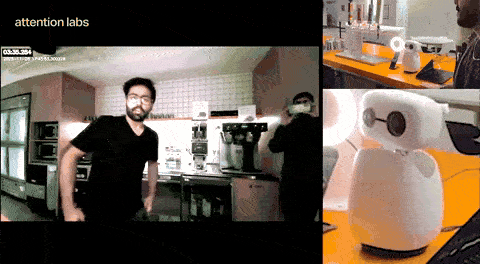
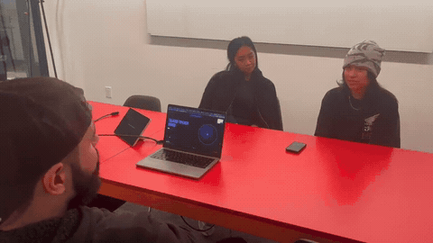
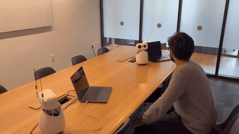
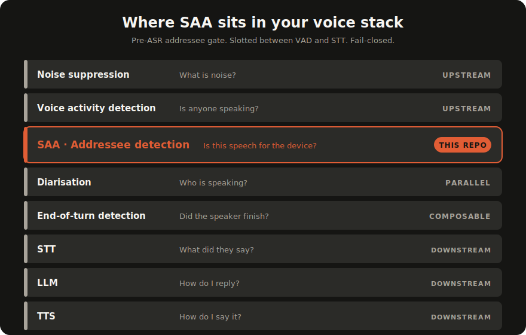

<p align="center">
  
</p>

<h3 align="center">Tells your voice agent which speech is actually for it.</h3>

<p align="center">One decision per utterance: only addressee speech reaches your STT, LLM, and TTS. No wake word required.</p>

<p align="center">
  <a href="https://www.npmjs.com/package/@attenlabs/saa-js"></a>
  <a href="https://pypi.org/project/attenlabs-saa/"></a>
  <a href="./LICENSE"></a>
  <a href="./.github/workflows/test.yml"></a>
</p>

<p align="center">Drop-in for the voice-agent stack you already use:</p>
<p align="center">
  <a href="./examples/twilio/"></a>
  &nbsp;&nbsp;
  <a href="./examples/pipecat/"></a>
  &nbsp;&nbsp;
  <a href="./examples/livekit/"></a>
  &nbsp;&nbsp;
  <a href="./examples/openai-realtime/"></a>
  &nbsp;&nbsp;
  <a href="./examples/elevenlabs-cai/"></a>
</p>

## What is SAA?

A voice agent's microphone hears every voice in the room: yours, a coworker's, the kids, a podcast playing on the laptop, the agent's own TTS bleeding back through the speakers. Most pipelines respond to any of it, paying STT for every transcribed second and triggering the LLM on speech that was never directed at the device.

<table>
  <thead>
    <tr>
      <th align="center" width="33%">Single device &middot; robot</th>
      <th align="center" width="33%">Single device &middot; laptop</th>
      <th align="center" width="34%">Multi-device &middot; two robots</th>
    </tr>
  </thead>
  <tbody>
    <tr>
      <td align="center"></td>
      <td align="center"></td>
      <td align="center"></td>
    </tr>
    <tr>
      <td align="center"><sub>Only addressed speech wakes the robot.</sub></td>
      <td align="center"><sub>Pill flips green only when the user addresses the screen.</sub></td>
      <td align="center"><sub>Same room, same audio &mdash; only the addressed robot acts.</sub></td>
    </tr>
  </tbody>
</table>

**SAA** (Selective Auditory Attention) is a hosted classifier that runs **before STT** and emits one `speechReady` event per device-directed utterance. Side talk, background media, and the agent's own playback are filtered server-side, so your STT / LLM / TTS only see audio meant for the agent.

- **No wake word.** SAA decides per-utterance from the audio (and optionally low-rate video) stream.
- **Hosted, not on-device.** A WebSocket to `server.attentionlabs.ai`; the open SDKs are thin clients. On-device deployment is a separate enterprise licence.
- **Drop-in adapters** for Twilio, Pipecat, LiveKit Agents, OpenAI Realtime, and ElevenLabs CAI, each with a working reference under [`examples/`](./examples/).

The architecture and evaluation are described in [arXiv:2604.08412](https://arxiv.org/abs/2604.08412); the paper is explicit that SAA is not a like-for-like substitute for every addressee-detection regime, so see the paper for operating points and caveats.

## Install

```bash
npm install @attenlabs/saa-js     # JavaScript
pip install attenlabs-saa          # Python
```

Get a token at [attentionlabs.ai/dashboard](https://attentionlabs.ai/dashboard).

## Quickstart

```js
import { AttentionClient } from "@attenlabs/saa-js";

const client = new AttentionClient({ token: process.env.ATTENLABS_TOKEN });
client.on("speechReady", (e) => yourSTT.send(e.audioBase64));
await client.start({ videoElement: document.querySelector("video") });
```

```python
import os
from saa import AttentionClient

client = AttentionClient(token=os.environ["ATTENLABS_TOKEN"])

@client.on_speech_ready
def _(event):
    your_stt.send(event.audio_base64)

client.start()
```

For phone calls, wearables, and other audio-only deployments, omit `videoElement` (browser) or pass `enable_video=False` (Python).

## Adapters

Working integrations under [`examples/`](./examples/). Each ships a `Dockerfile`, `Makefile`, smoke tests, and a per-stack README. These are real production references, not snippets.

| Stack | Path |
|---|---|
| Twilio Media Streams | [`examples/twilio/`](./examples/twilio/) |
| Pipecat | [`examples/pipecat/`](./examples/pipecat/) |
| LiveKit Agents | [`examples/livekit/`](./examples/livekit/) |
| OpenAI Realtime | [`examples/openai-realtime/`](./examples/openai-realtime/) |
| ElevenLabs Conversational AI | [`examples/elevenlabs-cai/`](./examples/elevenlabs-cai/) |

If your framework isn't listed, the cloud SDK is small enough that adapter code is usually under 300 lines, so copy the closest existing example and adapt.

## Proactive agents (speak first)

Some agents have to speak first: an outbound AI-SDR calling a lead, a meeting follow-up bot, a kiosk that greets visitors. Those interactions need a different lifecycle than the standard request-response shape. SAA's `mark_responding()` lifecycle lets the agent assert when it's the one speaking, suppressing the gate during its own TTS, and resume gating once the tail clears.

Five overlays in [`examples/proactive-agent/`](./examples/proactive-agent/), one per framework adapter:

| Stack | Path |
|---|---|
| Twilio (AI-SDR outbound calls) | [`examples/proactive-agent/twilio/`](./examples/proactive-agent/twilio/) |
| Pipecat (meeting follow-up) | [`examples/proactive-agent/pipecat/`](./examples/proactive-agent/pipecat/) |
| LiveKit (room-based proactive) | [`examples/proactive-agent/livekit/`](./examples/proactive-agent/livekit/) |
| OpenAI Realtime (laptop / coding / dashboard) | [`examples/proactive-agent/openai-realtime/`](./examples/proactive-agent/openai-realtime/) |
| ElevenLabs CAI (browser WebRTC) | [`examples/proactive-agent/elevenlabs-cai/`](./examples/proactive-agent/elevenlabs-cai/) |

The lifecycle helpers used by every overlay live in [`packages/saa-proactive-js/`](./packages/saa-proactive-js/) and [`packages/saa-proactive-py/`](./packages/saa-proactive-py/).

## How it composes

SAA is the addressee decision that sits between your VAD and STT. Not a VAD, not a wake word, not an end-of-turn detector: those layers continue to do their jobs around it.

<p align="center">
  
</p>

## Documentation

The core SDK reference is in each package; the framework adapters explain themselves in their own READMEs. The hosted docs site has the full reference.

- [`examples/README.md`](./examples/README.md): per-stack adapter index.
- [`examples/proactive-agent/README.md`](./examples/proactive-agent/README.md): proactive-agent overlay variants.
- [`packages/saa-js/README.md`](./packages/saa-js/README.md), [`packages/saa-py/README.md`](./packages/saa-py/README.md): SDK reference.
- [`packages/saa-gate/README.md`](./packages/saa-gate/README.md): production routing policy.
- [`packages/saa-proactive-js/README.md`](./packages/saa-proactive-js/README.md), [`packages/saa-proactive-py/README.md`](./packages/saa-proactive-py/README.md): proactive-agent lifecycle helpers.
- Full reference docs: [attentionlabs.ai/docs](https://attentionlabs.ai/docs).

## On-device deployment

The open SDKs stream to the SAA cloud. For deployments where audio must stay on the device — telephony, embedded systems, wearables, robotics, kiosks, and similar — direct on-device licensing is available. Contact us via [attentionlabs.ai](https://attentionlabs.ai).

## Citation

If you reference SAA in research, please cite the technical report ([arXiv:2604.08412](https://arxiv.org/abs/2604.08412)) and this repository. A [`CITATION.cff`](./CITATION.cff) is provided.

## License

Mixed-license monorepo:

- `packages/saa-js` and `packages/saa-py` ship under **MIT** (their published licences on npm and PyPI).
- `packages/saa-gate`, `packages/saa-proactive-{js,py}`, the `examples/` adapters, and the docs ship under **Apache-2.0**.
- Each package's `LICENSE` is authoritative for its subtree.
- The hosted cloud service is governed by the Attention Labs Terms of Service.

[`SECURITY.md`](./SECURITY.md) · [`CONTRIBUTING.md`](./CONTRIBUTING.md) · [`CODE_OF_CONDUCT.md`](./CODE_OF_CONDUCT.md) · [`CHANGELOG.md`](./CHANGELOG.md) · [`NOTICE`](./NOTICE)

---

<p align="center">
  <sub>An Attention Labs project. © 2026.</sub>
</p>
