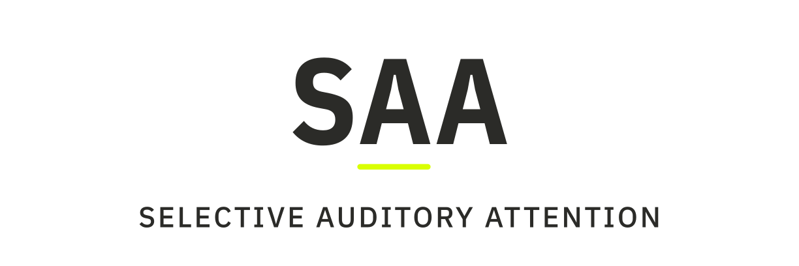

  

# SAA diagram system

Style tokens for every SVG in the repo. Keep new diagrams consistent with what's already here.

## Canonical sizes

| Tier | Where | viewBox |
|---|---|---|
| **Hero** | top of each `packages/*/README` | 820 × 220-280 |
| **Tile** | top of each `examples/*/README` | 820 × 200-220 |
| **Diagram** | section-level illustration | 820 × 320-460 |

`width="820"` is canonical for **every** SVG. No exceptions.

## Tokens

- Title: `22 / 700 / #151513`. Subtitle: `13 / 400 / #5c574e`. Section label: `10-11 / 700 / #A8A39A / 0.08em`. Card label: `13 / 700 / #151513`. Card subtitle: `11 / #5c574e`.
- Card fills: neutral `#ffffff` / stroke `#e5e7eb`. Positive (addressed): `#F7F6F2` / stroke `#D9FF00 sw 1.5`. Dark (cloud): `linear(#151513 → #2B2B28)`. All `rx: 12`.
- Background gradient `#bg` = `linear top→bottom · #F7F6F2 → #F7F6F2`.
- Accent (decision-positive only): primary `#D9FF00` · fill `#F7F6F2`.
- Grays (side speech, dropped): bg `#f3f4f6` · stroke `#d1d5db / #9ca3af` · text `#6b7280` · dashed `4 4`.
- Arrows: neutral `stroke #A8A39A sw 1.5` · addressed `stroke #D9FF00 sw 2`.
- Adapter brand accents live **only** on the adapter's own pill. The SAA gate keeps the canonical accent (lime `#D9FF00`).
- Font: `ui-sans-serif, system-ui, -apple-system, "Segoe UI", Roboto, sans-serif`. Monospaced: `ui-monospace, SFMono-Regular, Menlo, monospace`. Set on the root `<svg>`.

## Accessibility

`role="img"` plus `<title>` and `<desc>` linked via `aria-labelledby`. `<title>` is one declarative sentence; `<desc>` is one or two sentences a screen reader can convey.

## Adding a new diagram

1. Pick the smallest tier that fits.
2. Title is one sentence; subtitle is one sentence of context.
3. Decision-positive elements use the canonical accent (lime `#D9FF00`); everything else stays neutral.
4. Adapter brand colours live only on adapter pills.

---

  An attention labs project. © 2026 Socero Inc.

