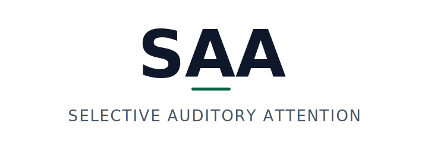

<p align="center">
  <a href="../../README.md">
    
  </a>
</p>

# SAA OBS overlay (example)

> Drop-in HTML overlay rendering SAA decisions. PASS · DROP ·
> ABSTAIN · OVERRIDE pills for OBS, dashboards, and demos.

This is **example code, not a published npm package.** Clone or copy
this directory into your project. The previous `@attenlabs/saa-overlay`
npm name is no longer published.

No deps. No framework. Six lines from copy-in to on-screen.

## Use

Build, then host `dist/saa-overlay.esm.js` and `src/overlay.css` from
your own origin (or copy them into your bundle), then:

```html
<link rel="stylesheet" href="/static/overlay.css">
<main id="root"></main>
<script type="module">
  import SaaOverlay from '/static/saa-overlay.esm.js';
  SaaOverlay.mount({ container: '#root', source: '/events', theme: 'dark' });
</script>
```

## API

```ts
SaaOverlay.mount({
  container: HTMLElement | string,
  source?: string | EventSource | WebSocket,    // ws:// → WebSocket, http → EventSource
  theme?: 'dark' | 'light' | 'obs',             // default 'obs' (transparent body)
}): { unmount(), push(event), getEntries() };
```

The log shows the last 3 entries within a rolling 30 s buffer. Event
shape: [`EVENTS.md`](./EVENTS.md). Schema:
[`schemas/event.schema.json`](./schemas/event.schema.json).

## Examples

[`openai-realtime.html`](./examples/openai-realtime.html) (SSE) ·
[`pipecat.html`](./examples/pipecat.html) (SSE) ·
[`livekit.html`](./examples/livekit.html) (WebSocket, light theme).

## Status

`v0.4.0`. Publishable but not gating the v1.0.0 SDK release.

## Bundle size

Measured by `npm pack --dry-run` from this directory on the current
`main`. Package-level hygiene budget is 16 kB / 20 files.

| Metric | Size |
|---|---|
| Tarball (gzipped, what npm ships) | **8.20 KB** |
| Tarball unpacked | **33.10 KB** |
| Files in tarball | 13 |
| Runtime dependencies | **0** |
| `dist/saa-overlay.umd.cjs` (gzipped) | **2.28 KB** |
| `dist/saa-overlay.esm.js` (gzipped) | 2.34 KB |

## License

Apache-2.0.

## See also

- [`packages/saa-js/README.md`](../../packages/saa-js/README.md) and [`packages/saa-py/README.md`](../../packages/saa-py/README.md): the SDKs that emit `prediction` / `stats` / `state` events the overlay subscribes to.
- [`examples/README.md`](../README.md): adapter index.


---

<p align="center">
  <sub>An Attention Labs project. © 2026.</sub>
</p>
